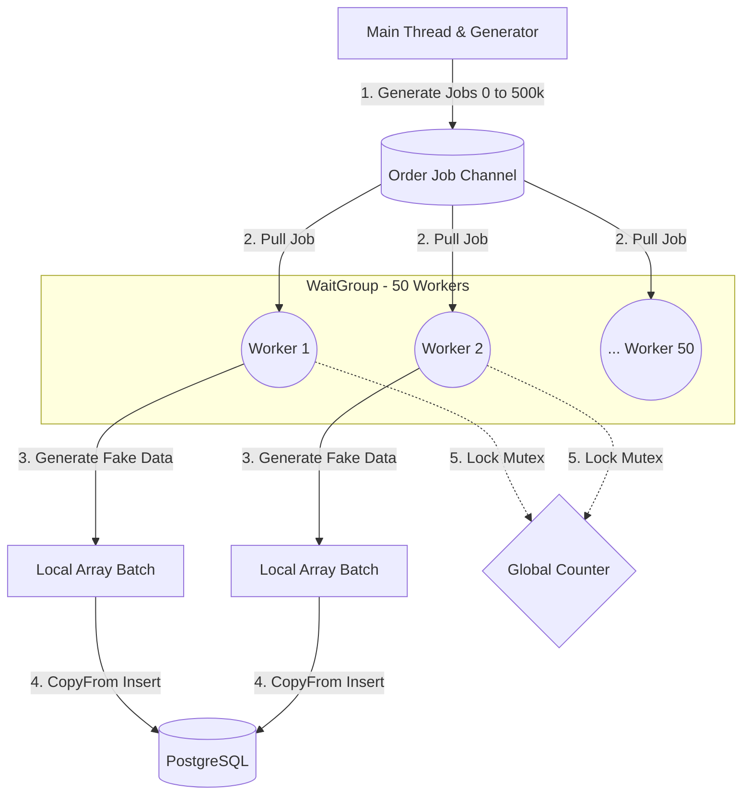
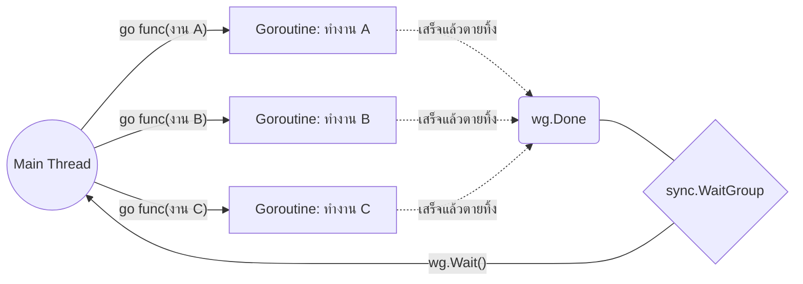
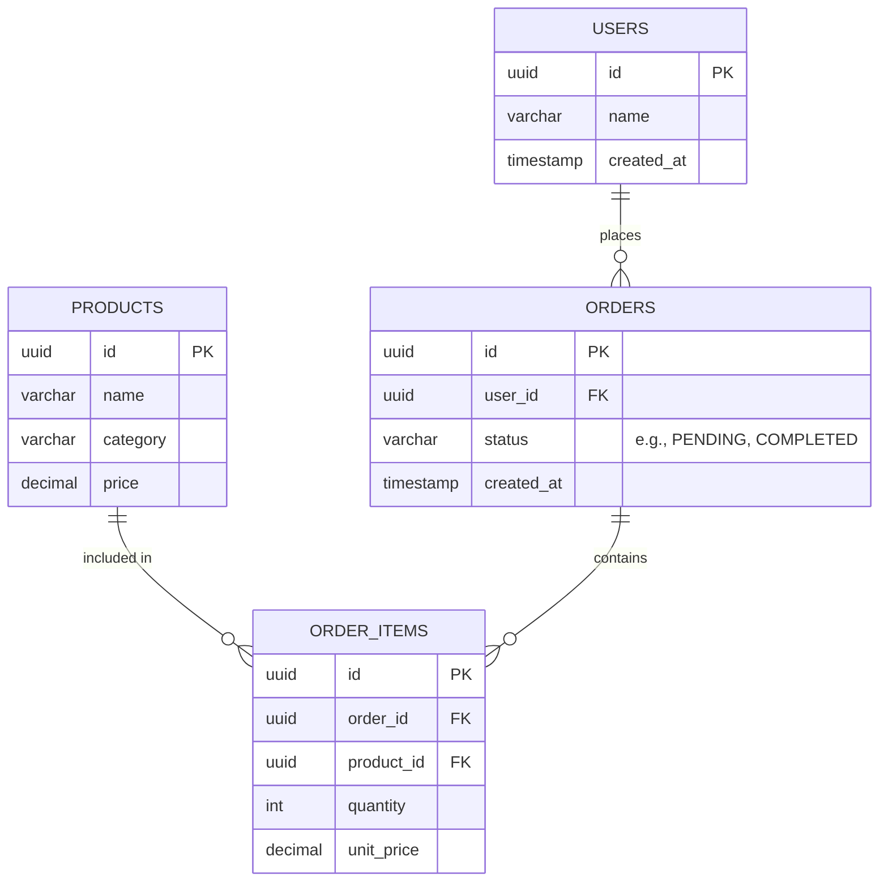
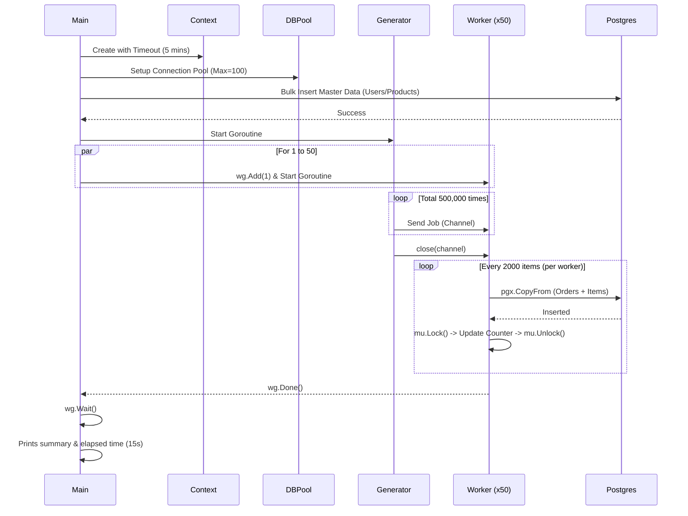

# Architecture & System Diagrams

เรื่อง Concurrency และ Database เป็นหัวข้อที่ซับซ้อน การมองภาพรวมให้ออกจะช่วยให้เข้าใจง่ายขึ้นมาก หน้านี้รวบรวม Diagram ต่างๆ ที่อธิบายระบบต่างๆ ในโปรเจกต์นี้ไว้ทั้งหมดครับ โดยใช้ **Mermaid** ในการเรนเดอร์ภาพ

---

## 🏗️ 1. Go Concurrency Architecture (Worker Pool Pattern)

ไดอะแกรมนี้อธิบายการทำงานของ **Phase 2 & Phase 3** ภาพรวมของโกรูทีน (Goroutines) และการรับส่งข้อมูลผ่าน `Channel` จะเป็นรูปแบบ **Generator-Processor (Worker Pool)**:

- **Generator (Main)**: หน้าที่คอยโยน "เลขงาน" (Job ID) ลงไปในกล่อง (Channel) 
- **Channel**: ท่อส่งข้อมูลที่เป็น Buffer ทำให้ Main รันต่อไปได้โดยไม่ต้องรอ Worker ทุกตัวพร้อม
- **Workers (Goroutines 1 to 50)**: โกรูทีนลูกข่าย 50 ตัววิ่งไปหยิบงานออกจากกล่อง มาสุ่มสร้างข้อมูล `orders` และ `order_items`
- **Mutex**: เมื่อ Worker ทำงานเสร็จ จะไปอัปเดต Counter รวม โดยต้องทำการ Lock `Mutex` เพื่อไม่ให้เกิด Data Race (แย่งกันเขียนข้อมูล)
- **Batching & Bulk Insert**: ยัดข้อมูลทีละ 2,000 ต่อ Worker ช่วยลดเวลาในการต่อท่อเข้า Database อย่างมหาศาล



### 💡 เจาะลึกระดับ Low-Level: Goroutine กับ Worker คือตัวเดียวกันไหม? ต่างกันอย่างไร?

คำถามนี้ดีมากๆ ครับ! เพื่อให้เห็นภาพที่แท้จริง เราต้องแยกคำว่ากริยาทางภาษาเขียนโค้ด (Syntax) กับรูปแบบสถาปัตยกรรม (Design Pattern) ออกจากกันก่อน:

- **Goroutine (กลไกพื้นฐานรันไทม์):** มันคือ Thread น้ำหนักเบา (Lightweight Thread) ที่ Go สร้างขึ้นมาให้ใช้งานด้วยคำสั่ง `go func()` 
- **Worker (ตำแหน่งหน้าที่):** มันคือ "แนวคิด/บทบาท" ที่เรามอบหมายให้ Goroutine นั้นๆ ทำงาน

ถ้าเปรียบเทียบให้เห็นภาพ: **Goroutine คือ "พนักงาน 1 คน"** ส่วน **Worker คือ "พนักงานที่ถูกจัดมารับหน้าที่ยืนประจำสายพานตักของ"**

คราวนี้ลองมาดูความต่างแบบขุดลึกของ 2 ท่านี้กันครับ:

#### 1. ท่า Basic Goroutine (Fire and Forget)
ท่าพื้นฐานที่มือใหม่ทุกคนเริ่มเขียน เป็นการใช้แค่คำสั่ง `go func()` โดดๆ ร่วมกับ `sync.WaitGroup` 



- **คอนเซ็ปต์พนักงาน (Goroutine):** งาน 1 ชิ้น จะจ้างพนักงาน 1 คนมาทำ (1 Job = 1 Goroutine) ทันทีที่พนักงานทำงาน A เสร็จ เขาจะรับเงินแล้วเดินออกจากบริษัทไปเลย (ทำเสร็จแล้วตายทิ้ง)
- **สมมติมีงาน 1,000,000 ชิ้น:** โปรแกรมจะแห่สร้าง Goroutines (พนักงาน) 1 ล้านคนมายืนอัดกันในบริษัทพร้อมๆ กัน!

**💻 ตัวอย่างโค้ด (ท่า Outsource):**
```go
for i := 0; i < 1000000; i++ {
    wg.Add(1)
    // ❌ สั่งสร้าง Goroutine ใหม่ 1 ล้านตัว! แต่ละตัวรัน 1 บรรทัดจบแล้วตาย
    go func(jobID int) {
        defer wg.Done()
        processTask(jobID)
    }(i)
}
wg.Wait()
```

- **ข้อดี ✅:** 
  - เหมาะกับงานอิสระที่ส่งไปแล้วจบเลย เช่น รัน API ไปเรียก Service อื่น 5 ตัวพร้อมกัน
  - โค้ดสั้นและตรงไปตรงมา ไม่ต้องดีไซน์อะไรเยอะ
- **Tradeoff (ข้อเสีย) 🔻:** 
  - ถ้านำไปใช้ผิดประเภทกับงานที่มี Volume มหาศาล CPU เครื่องจะรับไม่ไหว Memory จะพุ่งทะลุหลอดจนเกิดปัญหา **OOM (Out of Memory)** และแอปจะพังทันที
  - ควบคุมการแย่ง Resource ของระบบไม่ได้ เช่น ถ้าทำ Bulk Insert Database จำนวนมหาศาลๆ Postgres จะตะโกนด่าว่า `Too many clients (Connection limit exceeded)`

---

#### 2. ท่า Master Concurrency (Worker Pool & Channel)
ท่านี้คือการยกระดับ Architecture โดยเอากรอบของ **Worker** มาครอบ **Goroutine** อีกที ทำให้ทำงานแบบสเกลระดับอุตสาหกรรมได้

```mermaid
flowchart LR
    Main((Main Thread)) -- "โยนงานใส่สายพาน" --> Channel[(Job Channel)]
    
    subgraph Worker Pool (จ้าง Goroutines ไว้แค่ N ตัว)
        W1[Worker 1]
        W2[Worker 2]
        Wn[Worker N]
    end
    
    Channel -- "1. หยิบงานจากสายพาน" --> W1
    Channel -- "2. หยิบงานจากสายพาน" --> W2
    Channel -- "3. หยิบงานจากสายพาน" --> Wn
    
    W1 -.->|ทำเสร็จวนลูปไปดึงข้อ 1 ใหม่| Channel
```

- **คอนเซ็ปต์พนักงาน (Worker):** เราปฏิวัติระบบใหม่! เราฟิกซ์จำนวนพนักงานไว้เลย เช่น จ้างพนักงานแค่ 50 คน (50 Goroutines) แล้วบอกให้พวกเขายืนรออยู่หน้า **"สายพาน (Channel)"** 
  จากนั้น Main Thread จะคอยโยนงาน 1 ล้านชิ้นลงสายพาน พนักงานทั้ง 50 คนก็จะแย่งกันหยิบงานไปทำ **ทำเสร็จ 1 ชิ้นยังไม่ตาย!!** แต่จะหันกลับมาหยิบชิ้นต่อไปบนสายพานทำต่อเรื่อยๆ จนกว่างานบนสายพานจะหมด
- **จุดที่แตกต่าง (Why Channel?):** เพราะ Worker ไม่ได้ถูกกำหนดงานมาตั้งแต่เกิด (แบบ Basic) มันจึงต้องการ "จุดศูนย์กลาง" ที่ใช้รับส่งงาน นั่นก็คือ Channel ที่นอกจากจะใช้เก็บงานแล้ว ยังจัดการเรื่อง Blocking queue ไม่ให้แย่งงานกันมั่วซั่วด้วย (Data Thread-safety)

**💻 ตัวอย่างโค้ด (ท่า พนักงานประจำ Full-time):**
```go
jobs := make(chan int, 1000) // 📦 สร้างสายพาน (Channel)

// 1. รับสมัครพนักงานประจำ 50 คน (มายืนรอเตรียมหยิบของในสายพาน)
for w := 1; w <= 50; w++ {
    wg.Add(1)
    go func(workerID int) {
        defer wg.Done()
        // ✅ พนักงาน 1 คน มีชีวิตยืนยาว วนลูปหยิบของมาทำทีละชิ้นจนกว่าสายพานจะหยุด
        for job := range jobs { 
            processTask(job)
        }
    }(w)
}

// 2. นายจ้างโยนงาน 1 ล้านชิ้นลงสายพาน (พนักงาน 50 คนจะรุมดึงของไปทำเองเรื่อยๆ)
for i := 0; i < 1000000; i++ {
    jobs <- i
}
close(jobs) // ประกาศปิดสายพาน (เมื่อคิวว่าง พนักงานจะตายและแยกย้ายตามบรรทัดที่ 9)
wg.Wait()
```

- **ข้อดี ✅:** 
  - ควบคุม Resource ได้ 100% ถึงงานจะงอกมาเป็น 10 ล้านชิ้น เราก็ใช้ Memory สำหรับรัน 50 Goroutines เท่าเดิม เครื่อง Server นิ่งสนิทไม่มีทางค้าง
  - ทำ Batching นำเข้า Database ยอดเยี่ยมมาก ไม่ต้องกังวลว่า Connection DB จะบึ้ม เพราะเปิดออกไปเต็มที่ก็แค่ 50 Connections เท่านั้น
- **Tradeoff (ข้อเสีย) 🔻:** 
  - เขียนโค้ดยากขึ้น ต้องระวังเรื่องจังหวะการเปิด/ปิดท่อ `close(channel)` เพราะถ้าปิดผิดจังหวะ หรือสั่ง WaitGroup ผิด อาจเจอปัญหา **Deadlock** (Worker ยืนรอกันไปมาจนแอปค้างกึก)
  
> **สรุปเปรียบเทียบง่ายๆ:** 
> **Basic** = จ้างมอเตอร์ไซค์รับจ้าง 1 คันไปส่งของ 1 กล่อง (ถ้ามีแสนกล่อง ก็เรียกมอเตอร์ไซค์แสนคัน รถติดตาย)
> **Master (Worker Pool)** = ซื้อรถบรรทุกใหญ่ 50 คัน วิ่งวนรอบเอาของไปส่งทีละล็อตจนกว่าจะหมด (บริหารจัดการง่ายกว่ามาก)

---

## 🗄️ 2. Database Schema (ER Diagram)

ภาพรวมของตารางทั้งหมดภายใน PostgreSQL ที่ถูกสร้างจาก `Phase 1` เป็นโครงสร้างคลาสสิกของระบบ **E-Commerce** เราจะใช้ตารางเหล่านี้ให้เป็นประโยชน์หนักๆ ในการทำ Query `GROUP BY` ของ Phase ถัดๆ ไป



---

## ⏱️ 3. Execution Flow (Sequence Diagram)

การไล่ลำดับการทำงาน (Sequence) ตั้งแต่เราสั่ง `go run cmd/seed/main.go` จนโปรแกรมทำงานเสร็จ จะเห็นได้ว่าจังหวะที่ Worker 50 ตัวทำงาน มันไม่ได้ทำแบบเส้นตรง (Synchronous) แต่ทำพร้อมกันทั้งหมด (Asynchronous/Concurrent) 



> **📌 Note สำหรับคนอ่าน Diagram:** ถ้าใช้เครื่องมือที่รองรับ Markdown ขั้นสูง (เช่น VS Code, Cursor หรือ หน้าเว็บของ GitHub) โค้ด Mermaid ด้านบนจะถูกแปลงเป็นรูปภาพอันสวยงามให้ทันทีครับ
