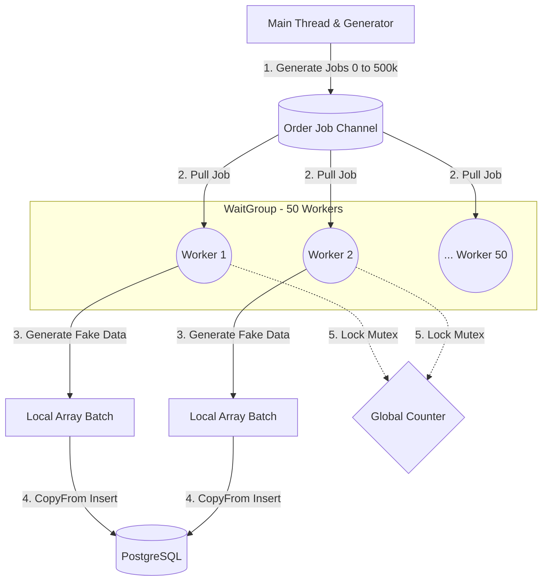
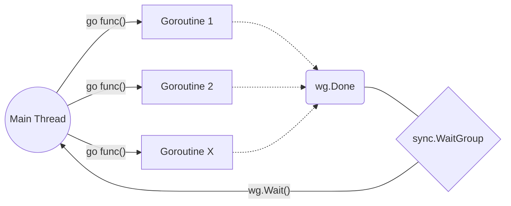
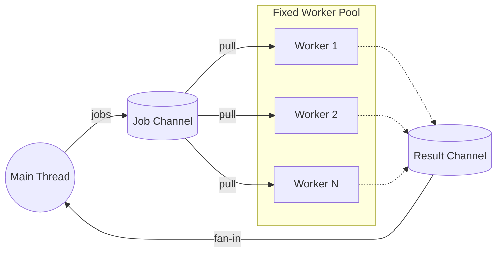
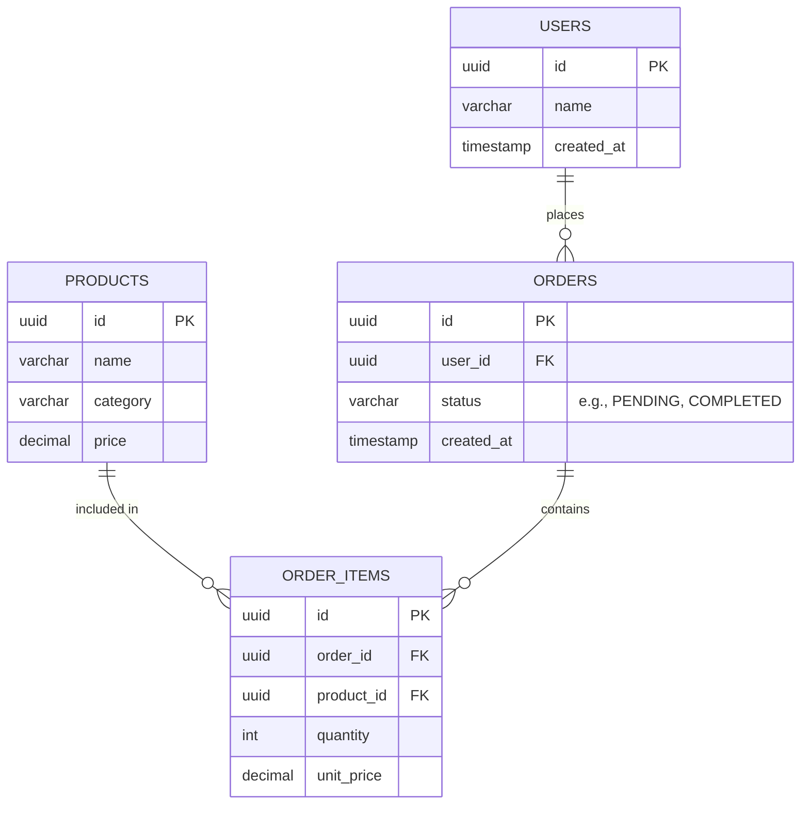
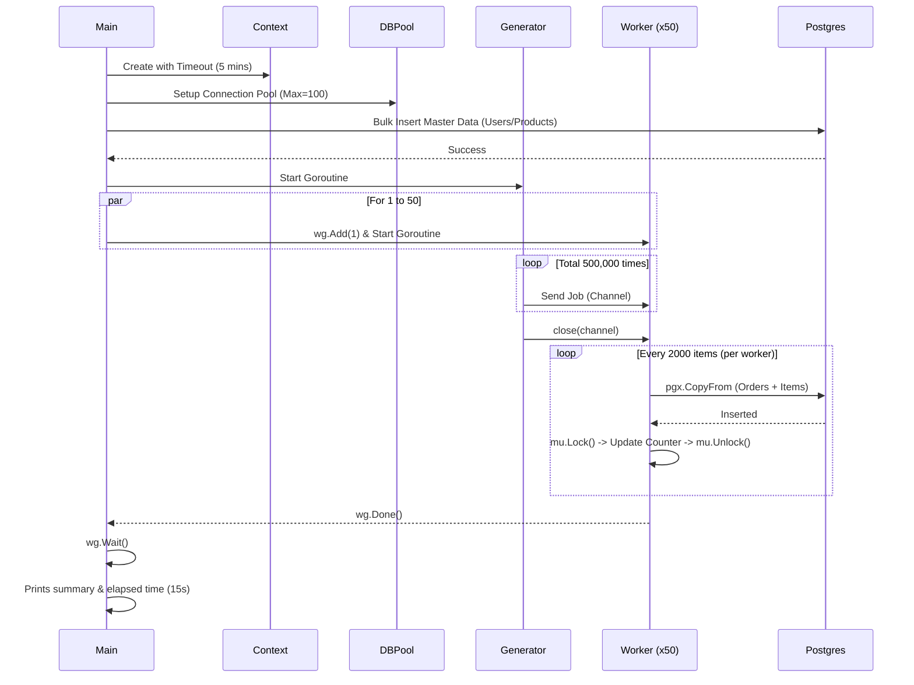

# Architecture & System Diagrams

เรื่อง Concurrency และ Database เป็นหัวข้อที่ซับซ้อน การมองภาพรวมให้ออกจะช่วยให้เข้าใจง่ายขึ้นมาก หน้านี้รวบรวม Diagram ต่างๆ ที่อธิบายระบบต่างๆ ในโปรเจกต์นี้ไว้ทั้งหมดครับ โดยใช้ **Mermaid** ในการเรนเดอร์ภาพ

---

## 🏗️ 1. Go Concurrency Architecture (Worker Pool Pattern)

ไดอะแกรมนี้อธิบายการทำงานของ **Phase 2 & Phase 3** ภาพรวมของโกรูทีน (Goroutines) และการรับส่งข้อมูลผ่าน `Channel` จะเป็นรูปแบบ **Generator-Processor (Worker Pool)**:

- **Generator (Main)**: หน้าที่คอยโยน "เลขงาน" (Job ID) ลงไปในกล่อง (Channel) 
- **Channel**: ท่อส่งข้อมูลที่เป็น Buffer ทำให้ Main รันต่อไปได้โดยไม่ต้องรอ Worker ทุกตัวพร้อม
- **Workers (Goroutines 1 to 50)**: โกรูทีนลูกข่าย 50 ตัววิ่งไปหยิบงานออกจากกล่อง มาสุ่มสร้างข้อมูล `orders` และ `order_items`
- **Mutex**: เมื่อ Worker ทำงานเสร็จ จะไปอัปเดต Counter รวม โดยต้องทำการ Lock `Mutex` เพื่อไม่ให้เกิด Data Race (แย่งกันเขียนข้อมูล)
- **Batching & Bulk Insert**: ยัดข้อมูลทีละ 2,000 ต่อ Worker ช่วยลดเวลาในการต่อท่อเข้า Database อย่างมหาศาล

### 💡 เจาะลึกระดับ Low-Level: ทำไมต้องใช้ Channel? และ Basic Goroutine ต่างกันอย่างไร?

หลายคนอาจเคยได้ยินว่า **"Goroutine พื้นฐาน ไม่จำเป็นต้องใช้ Channel ก็ได้"** ซึ่งเป็นเรื่องจริงครับ! การเลือกใช้งานโกรูทีนแบ่งได้เป็น 2 ระดับหลักๆ ดังนี้:

#### 1. Basic Goroutine (Fire and Forget)

- **การทำงาน:** ใช้แค่คำสั่ง `go func()` ร่วมกับ `sync.WaitGroup` โกรูทีนจะถูกสร้างเป็นเซกเมนต์ประมวลผลแบบเบา (Lightweight Thread) วิ่งไปทำงานของมันเองโดดๆ จนจบแล้วก็สลายตัวไป
- **อะไรที่หายไป (เทียบกับ Master):** ❌ไม่มี Channel ❌ไม่มี Worker Pool
- **Usecase ที่เหมาะสม:** งานคู่ขนานที่ไม่ซับซ้อน จำนวนไม่เยอะมาก และไม่ต้องส่งค่ากลับมาบอก Main Thread เช่น 
  - ส่ง Notification/อีเมล ไปหาลูกค้า 5 คนพร้อมกัน
  - อัปโหลดรูปภาพ 3 รูปขึ้น S3
- **Tradeoff (ข้อดี-ข้อเสีย):** 
  - ✅ เขียนง่าย โค้ดสั้น อ่านปราดเดียวเข้าใจ
  - 🔻 **ห้ามใช้กับงานระดับแสน/ล้าน:** ถ้าคุณรัน `go func()` วนลูป 1,000,000 ครั้ง CPU จะสร้างหมื่นแสน Thread แล้วเจอเคส Memory พุ่งจนแอปปลิว (OOM) และ Database Connection จะพังทลาย (Too many clients)

#### 2. Master Concurrency (Worker Pool + Channel)

- **การทำงาน:** เราจะล็อกเพดานจำกัดจำกัดจำนวนโกรูทีนไม่ให้บานปลาย (เช่น ฟิกซ์ไว้แค่ 50 ตัว) แล้วนำ **"Channel"** มาใช้เป็น **"สายพานลำเลียงงาน"** ให้ Worker ทะยอยดึงงานไปทำจนกว่าจะหมดสายพาน
- **ทำไมต้องมี Channel?:** ในระดับ Low-level โกรูทีนแต่ละตัวมีพื้นที่ Memory ของตัวเอง การจะเชื่อมโยงคุยกันหรือส่งข้อมูลข้ามกัน *อย่างปลอดภัย* โดยไม่เกิด Data Race จะต้องใช้ท่อ Channel ในการส่งของ (ตามปรัชญาสูงสุดของทีม Go: *Don't communicate by sharing memory; share memory by communicating*)
- **Usecase ที่เหมาะสม:** งานสเกลใหญ่ประมวลผลเป็นล้านๆ Record, ระบบคิว (Job Queue), Bulk Insert หนักๆ แบบในโปรเจกต์นี้
- **Tradeoff (ข้อดี-ข้อเสีย):** 
  - ✅ ควบคุมการบริโภคทรัพยากรระบบ (Resource Limit) ได้ 100% เครื่อง Server ไม่มีทางค้าง รับมือโหลดไหวแน่นอน
  - 🔻 ลอจิกซับซ้อนกว่า ต้องเข้าใจเรื่อง Blocking และจัดการปิดตายาวๆ ด้วยการ `close(channel)` ไม่งั้นอาจเกิดบั๊ก Deadlock (แอปค้างกึกงงๆ) ได้

> **สรุป:** ถ้างานหลัก 10-100 ชิ้น และต่างคนต่างทำ ใช้ **Basic (`sync.WaitGroup`)** ก็พอครับ แต่ถ้าหลักหมื่น/ล้าน หรือขูดข้อมูลมหาศาลๆ ต้องขยับมาตีตี้เข้าบอสด้วย **Master (`Worker Pool + Channel`)** ควบคู่กับการควบคุม Database Connection เสมอครับ

---

## 🗄️ 2. Database Schema (ER Diagram)

ภาพรวมของตารางทั้งหมดภายใน PostgreSQL ที่ถูกสร้างจาก `Phase 1` เป็นโครงสร้างคลาสสิกของระบบ **E-Commerce** เราจะใช้ตารางเหล่านี้ให้เป็นประโยชน์หนักๆ ในการทำ Query `GROUP BY` ของ Phase ถัดๆ ไป

---

## ⏱️ 3. Execution Flow (Sequence Diagram)

การไล่ลำดับการทำงาน (Sequence) ตั้งแต่เราสั่ง `go run cmd/seed/main.go` จนโปรแกรมทำงานเสร็จ จะเห็นได้ว่าจังหวะที่ Worker 50 ตัวทำงาน มันไม่ได้ทำแบบเส้นตรง (Synchronous) แต่ทำพร้อมกันทั้งหมด (Asynchronous/Concurrent) 

> **📌 Note สำหรับคนอ่าน Diagram:** ถ้าใช้เครื่องมือที่รองรับ Markdown ขั้นสูง (เช่น VS Code, Cursor หรือ หน้าเว็บของ GitHub) โค้ด Mermaid ด้านบนจะถูกแปลงเป็นรูปภาพอันสวยงามให้ทันทีครับ
