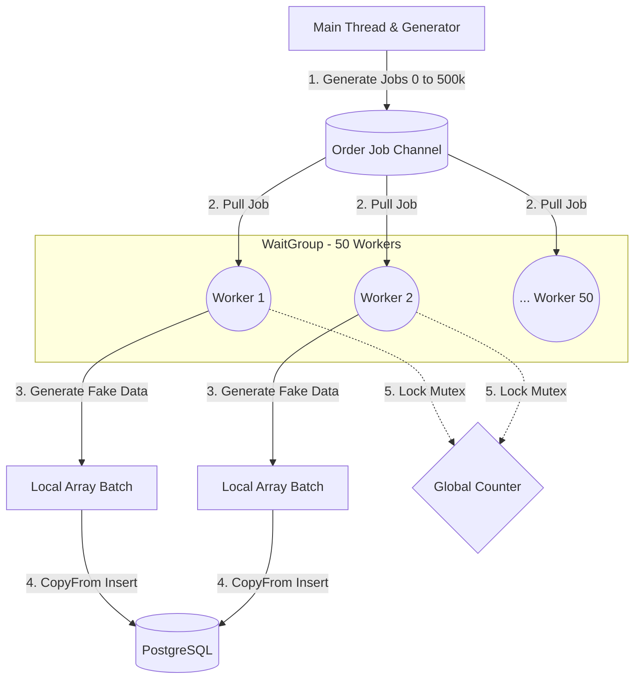
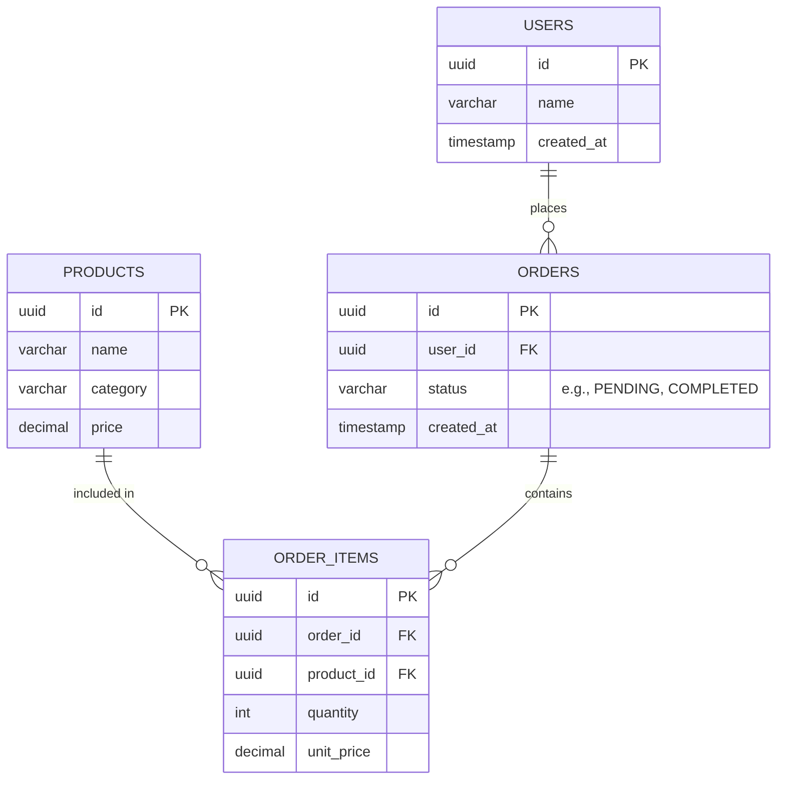
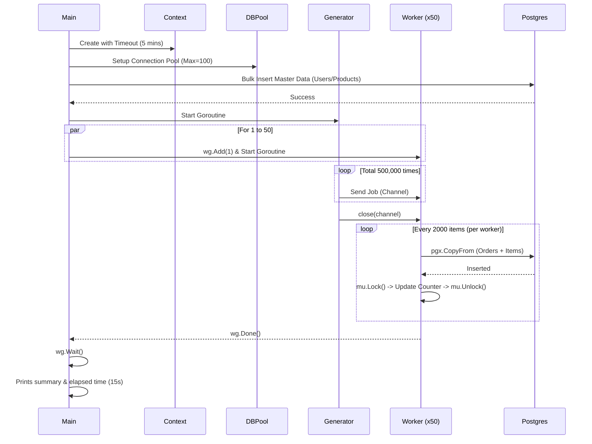

# Architecture & System Diagrams

เรื่อง Concurrency และ Database เป็นหัวข้อที่ซับซ้อน การมองภาพรวมให้ออกจะช่วยให้เข้าใจง่ายขึ้นมาก หน้านี้รวบรวม Diagram ต่างๆ ที่อธิบายระบบต่างๆ ในโปรเจกต์นี้ไว้ทั้งหมดครับ โดยใช้ **Mermaid** ในการเรนเดอร์ภาพ

---

## 🏗️ 1. Go Concurrency Architecture (Worker Pool Pattern)

ไดอะแกรมนี้อธิบายการทำงานของ **Phase 2 & Phase 3** ภาพรวมของโกรูทีน (Goroutines) และการรับส่งข้อมูลผ่าน `Channel` จะเป็นรูปแบบ **Generator-Processor (Worker Pool)**:

- **Generator (Main)**: หน้าที่คอยโยน "เลขงาน" (Job ID) ลงไปในกล่อง (Channel) 
- **Channel**: ท่อส่งข้อมูลที่เป็น Buffer ทำให้ Main รันต่อไปได้โดยไม่ต้องรอ Worker ทุกตัวพร้อม
- **Workers (Goroutines 1 to 50)**: โกรูทีนลูกข่าย 50 ตัววิ่งไปหยิบงานออกจากกล่อง มาสุ่มสร้างข้อมูล `orders` และ `order_items`
- **Mutex**: เมื่อ Worker ทำงานเสร็จ จะไปอัปเดต Counter รวม โดยต้องทำการ Lock `Mutex` เพื่อไม่ให้เกิด Data Race (แย่งกันเขียนข้อมูล)
- **Batching & Bulk Insert**: ยัดข้อมูลทีละ 2,000 ต่อ Worker ช่วยลดเวลาในการต่อท่อเข้า Database อย่างมหาศาล

---

## 🗄️ 2. Database Schema (ER Diagram)

ภาพรวมของตารางทั้งหมดภายใน PostgreSQL ที่ถูกสร้างจาก `Phase 1` เป็นโครงสร้างคลาสสิกของระบบ **E-Commerce** เราจะใช้ตารางเหล่านี้ให้เป็นประโยชน์หนักๆ ในการทำ Query `GROUP BY` ของ Phase ถัดๆ ไป

---

## ⏱️ 3. Execution Flow (Sequence Diagram)

การไล่ลำดับการทำงาน (Sequence) ตั้งแต่เราสั่ง `go run cmd/seed/main.go` จนโปรแกรมทำงานเสร็จ จะเห็นได้ว่าจังหวะที่ Worker 50 ตัวทำงาน มันไม่ได้ทำแบบเส้นตรง (Synchronous) แต่ทำพร้อมกันทั้งหมด (Asynchronous/Concurrent) 

> **📌 Note สำหรับคนอ่าน Diagram:** ถ้าใช้เครื่องมือที่รองรับ Markdown ขั้นสูง (เช่น VS Code, Cursor หรือ หน้าเว็บของ GitHub) โค้ด Mermaid ด้านบนจะถูกแปลงเป็นรูปภาพอันสวยงามให้ทันทีครับ
