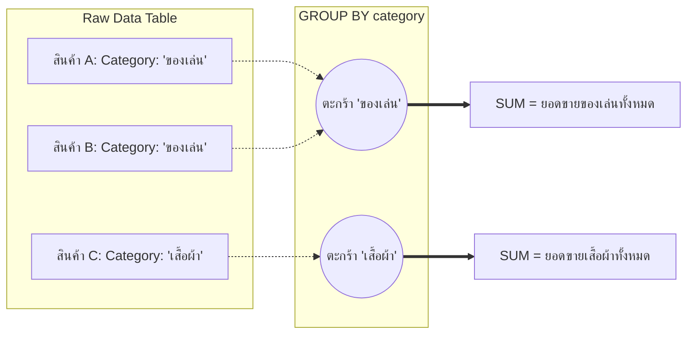
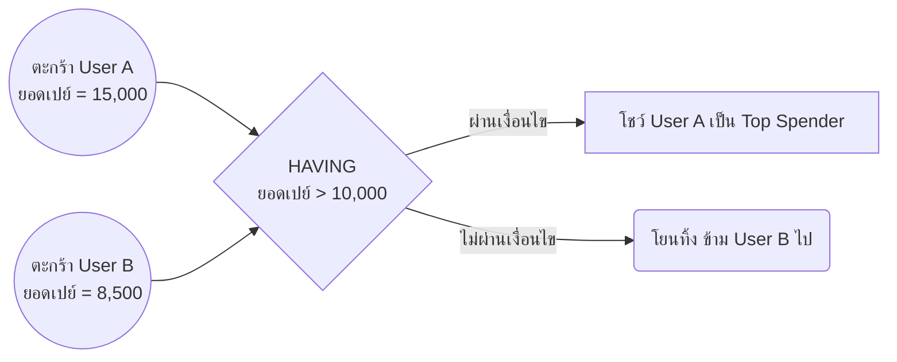

# 📊 SQL Analytics Concepts (Visualized)

หน้านี้อธิบาย 3 คอนเซปต์หลักที่ใช้ใน **Phase 1** ของโปรเจกต์ เรียงลำดับจากพื้นฐานไปสู่ขั้นสูง เพื่อให้เห็นภาพการทำงานของ Database Engine อย่างชัดเจนผ่านกราฟิกครับ

---

## 1️⃣ `GROUP BY` (จับกลุ่มและรวบยอด)
**ลอจิก:** การนำเอาข้อมูลดิบ (Raw Rows) ที่มีบางคอลัมน์เหมือนกัน มา **"จับยัดลงตะกร้าเดียวกัน" (Bucketing)** แล้วทำการบวกรวมยอด (Aggregate) ตัวอย่างเช่น การหายอดขายรวมของสินค้า `Category` เดียวกัน 


> **ข้อสังเกต:** แถวของข้อมูลดิบ (A, B) หายไป กลายเป็นตัวแทนเพียง 1 แถวต่อกลุ่ม (ตะกร้าของเล่น)

---

## 2️⃣ `HAVING` (ฟิลเตอร์กรองตะกร้า)
หลายคนสับสนระหว่าง `WHERE` กับ `HAVING` จำง่ายๆ คือ:
- `WHERE` กรองข้อมูลดิบ **ก่อน** ที่จะเอาลงตะกร้า
- `HAVING` กรองผลรวม **หลัง** จากที่รวมตะกร้าเสร็จแล้ว

**ลอจิก:** ในตัวอย่าง **Top Spenders** เราต้องการโชว์แค่คนที่ "ยอดซื้อของเกิน 10,000 บาท" เราจึงต้องใช้ `HAVING SUM() > 10000`



---

## 3️⃣ Window Functions (จัดอันดับแบบไม่ทำลายแถว)
**ลอจิก:** พระเอกของ **Best Sellers by Category** ตัวที่ขั้นสูงที่สุด `RANK() OVER(PARTITION BY ...)` ถือเป็นคำสั่งสาย Analytics ระดับเทพ 
- ถ้าใช้ `GROUP BY` ข้อมูลย่อยๆ จะหายไปเหลือแค่สรุปรวม 
- แต่ถ้าใช้ `Window Function` (ตัวแบ่งหน้าต่างตาราง) **ข้อมูลทุกแถวยังอยู่ครบ!** แต่เราจะได้คอลัมน์ใหม่ที่ "จัดอันดับ" แยกเป็นหมวดหมู่ให้

```mermaid
flowchart TD
    subgraph ตารางผลลัพธ์ (ทุกแถวยังอยู่ครบ)
        subgraph PARTITION BY 'เสื้อผ้า'
            Row1[เสื้อยืด: ขายได้ 500] -.-> Rank1_A(จัดอันดับให้เป็น: Rank 1)
            Row2[กางเกง: ขายได้ 200] -.-> Rank2_A(จัดอันดับให้เป็น: Rank 2)
        end
        
        subgraph PARTITION BY 'ของเล่น'
            Row3[ตัวต่อ: ขายได้ 1000] -.-> Rank1_B(จัดอันดับให้เป็น: Rank 1)
            Row4[หุ่นยนต์: ขายได้ 800] -.-> Rank2_B(จัดอันดับให้เป็น: Rank 2)
            Row5[รถบังคับ: ขายได้ 10] -.-> Rank3_B(จัดอันดับให้เป็น: Rank 3)
        end
    end
    
    FilterOut{WHERE Rank = 1}
    
    Rank1_A ==> FilterOut
    Rank2_A -...-> |ตีตกไป|X(ลบทิ้ง)
    
    Rank1_B ==> FilterOut
    Rank2_B -...-> |ตีตกไป|X
    Rank3_B -...-> |ตีตกไป|X
    
    FilterOut ==> Final[สรุปเหลือแค่: 🥇 เสื้อยืด และ 🥇 ตัวต่อ]
```
> **ผลลัพธ์:** ทำให้เรารู้แชมป์ดับดับ 1 ของทุกๆ Category โผล่ขึ้นมาเรียงกันได้อย่างง่ายดาย โดยใช้คำสั่ง `SELECT ... WHERE rank = 1` ซ้อนข้างนอกเข้าไปตัวเดียวเท่านั้น!
